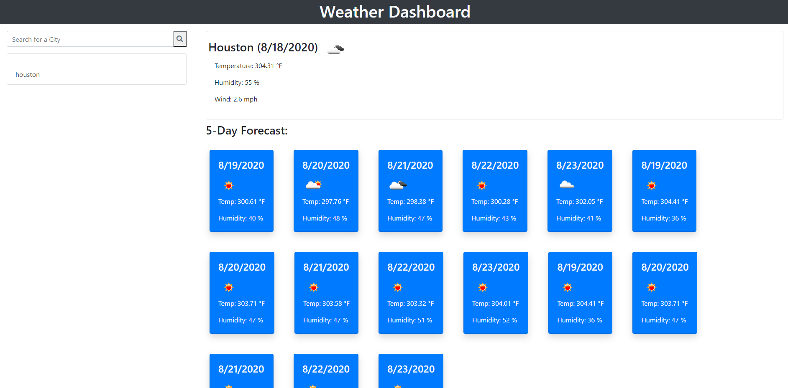

#  5 homeworkWeather


THe purpose of this homework was to create a weather dashboard with the Open Weather API to gather and pull our data on to the dashboard. The user would have to search for a city, keep a log of the city, and provide the current weather information with UV index and then provide a 5-day forecast in individual cards by day.

## Prerequisites

```
Used Visual Studio Code and chrome's inspector tool to help build and rework code. Built HTML framework and styling with Bootstrap.
```
https://lisaworsham.github.io/homeworkWeather/

## Process/What was Changed

```
First was getting the HTML framework up. Figuring out the row with 2 columns and getting the card divs added so when the attribute is called, it'll have the script append it to the proper div to show.

Next was the logic. I had to make sure I was using the proper API url queries that were involved. And define variables. Then used functions to start pulling my information from the API. 

Once I got that, I went on to add the cards for the forecast and try to pull the UVIndex with lat and lon. I eventually had to give up on UVIndex and try to come back to it. (which as you can see, I never did make it work quite right!)

I was able to get my local storage working but not quite getting the search to work properly when a city is entered in at first. You have to enter a city and then click on it to work. But my forecast cards aren't properly either.

I've been trying to figure out why it's not working but ran out of time. 

```

## Review

```
This homework roughed me up worse than the quiz... I've been noticing there are several different ways to making queryAPIs with your code. And everyone does it differently. I just need to find my way and stick to it. I don't think what I had was working with my code. If I had more time, I think I could have gotten it to work better for me.

```

- - -
© 2020 Lisa Worsham Services, Inc. All Rights Reserved.